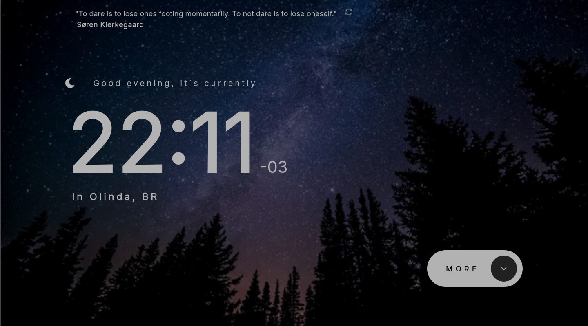

# Frontend Mentor - Clock app solution

This is a solution to the [Clock app challenge on Frontend Mentor](https://www.frontendmentor.io/challenges/clock-app-LMFaxFwrM). Frontend Mentor challenges help you improve your coding skills by building realistic projects.

## Table of contents

- [Overview](#overview)
  - [The challenge](#the-challenge)
  - [Screenshot](#screenshot)
  - [Links](#links)
- [My process](#my-process)
  - [Built with](#built-with)
  - [What I learned](#what-i-learned)
  - [Continued development](#continued-development)
  - [Useful resources](#useful-resources)
- [Author](#author)
- [Acknowledgments](#acknowledgments)

## Overview

### The challenge

Users should be able to:

- View the optimal layout for the site depending on their device's screen size
- See hover states for all interactive elements on the page
- View the current time and location information based on their IP address
- View additional information about the date and time in the expanded state
- Be shown the correct greeting and background image based on the time of day they're visiting the site
- Generate random programming quotes by clicking the refresh icon near the quote

### Screenshot



### Links

- Solution URL: [Add solution URL here](https://github.com/ttsoares/webclock)
- Live Site URL: [Add live site URL here](https://webclock-amber.vercel.app/)

## My process

### Built with

- Clone a repo with a solution for this challenge
- Mygrate it to Typescript
- Fix the Tailwind bad usages
- Refactor the APIs call to avoid CORS issues
- Choose working external APIs
- [React](https://reactjs.org/) - JS library
- [Next.js](https://nextjs.org/) - React framework
- [TailwindCSS](https://tailwindcss.com/) - For styles

### What I learned

I did refresh memory about the proper handdle of external API calls with NextJS.

```js
export const runtime = "nodejs";

export async function GET() {
  const isDev = process.env.NODE_ENV === "development";

  if (isDev) {
    return NextResponse.json(FALLBACK_RESPONSE, { status: 200 });
  }

  try {
    const token = process.env.REACT_APP_IPINFO_TOKEN;

    const res = await fetch(`http://ipinfo.io?token=${token}`);
    const data = await res.json();

    return NextResponse.json(data);
  } catch {
    return NextResponse.json(
      { error: "Failed to fetch location" },
      { status: 500 }
    );
  }
}
```

### Continued development

With this solution, as well as the previous one, I started with someone else's code rather than writing from scratch. The goal was to learn how to debug and improve existing code.
This approach is more challenging than starting from zero because it requires significantly more effort to understand what was already working well and what needed to be fixed.

### Useful resources

- [NextJS](https://dev.to/rhythmsaha/how-to-set-up-a-nextjs-project-with-typescript-and-tailwind-css-2hk7) - How to Set Up a Next.js Project

## Author

- Website - [Thomas TS](https://buildesign.vercel.app/)
- Frontend Mentor - [@ttsoares](https://www.frontendmentor.io/profile/ttsoares)
- Linkedin - [thomas-soares-6791781b/](https://www.linkedin.com/in/thomas-soares-6791781b/)

## Acknowledgments

Mentorship of different AIs like ChatGPT, DeepSeek and Windsurf.
